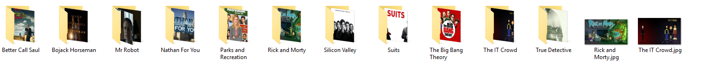
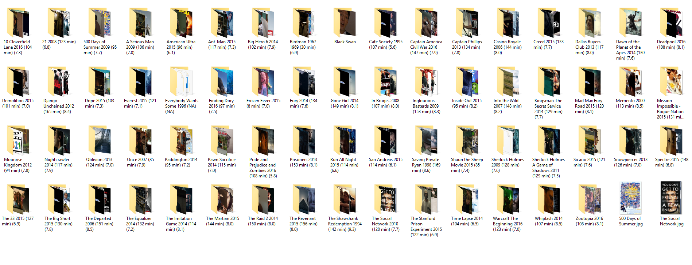

# Torrent-Organizer

It organizes your movies and tv shows into their respective folders with posters. It also converts SDH subtitles to normal subtitles.

Your torrented files probably look like this
- Manchester.by.the.Sea.2016.1080p.WEB-DL.DD5.1.H264-FGT.mkv
- Modern.Family.S05E02.720p.5.1Ch.Web-DL.ReEnc-DeeJayAhmed.mkv

This script makes it look like this

### Tv Shows

### Movies

**Note (only when the mode is `--no-link`)** - It will delete all the files that are not `.mp4, .avi, .mkv, .avi and .srt`. This is to make sure that the script deletes all the unnecessary `.txt`, `.nfo`, folders remaining after the rename and sample video files. Best to use this script on a folder which only contains movies and tv shows.

## How to use
- Install node
- clone this repository
- cd into torrent-organizer and `npm install`
- Use `node ./parse.js path --mode`

### Options
- `path` (required) - It is the folder where your tv shows and movies are. Make sure your path is in double quotes.
- `--mode` (required) - There are three modes `--symlink`, `--hardlink`, `--no-link`
  - `--symlink` - To use this, **open cmd as administrator**. It creates shortcut of the files with formatted names instead of renaming the original files. Recommended to use on torrents that are being seeded.
  - `--hardlink` - To use this, **open cmd as administrator**. It creates new files with formatted names without taking extra space. If the original files are deleted, hard linked files will take the space. Basically duplicates of files without taking extra space. Recommended to use on torrents that being seeded.
  - `--no-link` - This renames the files and deletes the unnecessary files. **This will stop seeding.**
